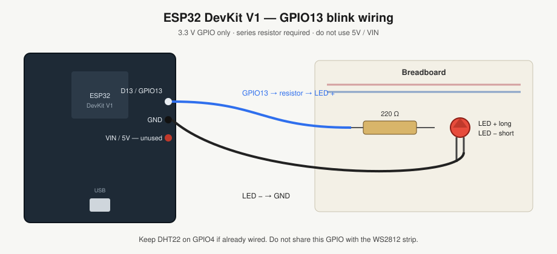

# ESP32 blink (ESP-IDF + PlatformIO)

First hardware check for the UnifyHQ sensor node.

- Board: ESP32 DevKit V1 30-pin (CP2102)
- Framework: ESP-IDF via PlatformIO (not Arduino)
- LED: breadboard, GPIO13 (D13), series 220 Ω
- Confirmed working: 2026-09-14

## Wiring



```
ESP32 D13 (GPIO13) → 220 Ω → LED long leg (+) → LED short leg (−) → ESP32 GND
```

D13 sits next to GND on the 30-pin DevKit V1. Use that GND. Do not use 5V / VIN. GPIO4 stays reserved for DHT22.

## Build

```ini
; platformio.ini
[env:esp32dev]
platform = espressif32
board = esp32dev
framework = espidf
monitor_speed = 115200
```

Upload at 115200. Serial monitor should print `LED ON` / `LED OFF` every 500 ms.
